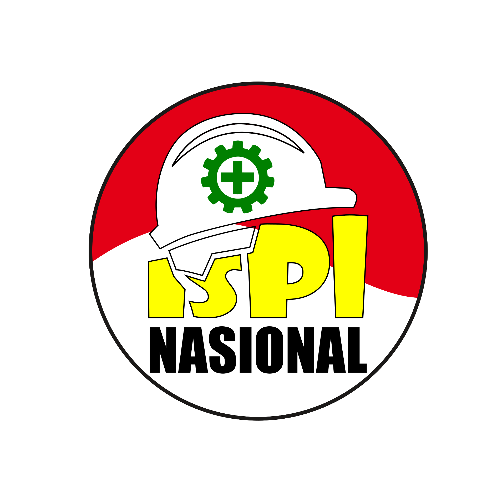

# 🏗️ ISPI Nasional Website

[](https://ispinasional.or.id)  
**Ikatan Supervisi Nasional**  
🌟 *Mengawal Kualitas Konstruksi Indonesia* 🌟  

---

## 🚀 Deployment Guide

### GitHub Pages
```bash
npm install
npm run build
npm run deploy

🌍 Live URL: https://ISPI-Nasional.github.io/web

Cloudflare Pages
    Connect GitHub repository
    Build settings:
        Build command: npm run build
        Output directory: build

    Add environment variable:
        NODE_VERSION = 18

☁️ Production URL: https://ispinasional.or.id
🤝 Cara Berkontribusi
graph TB
    A[Fork Repository] --> B[Clone Project]
    B --> C[Buat Branch Baru]
    C --> D[Commit Perubahan]
    D --> E[Push ke GitHub]
    E --> F[Buat Pull Request]
Langkah Detail:

    🍴 Fork repo ini
    bash
    Copy

    git clone https://github.com/[USERNAME-ANDA]/web.git
    cd web
    git checkout -b kontribusi-anda

    💻 Lakukan perubahan
    bash
    Copy

    git add .
    git commit -m "Menambahkan fitur: [JELASKAN PERUBAHAN]"
    git push origin kontribusi-anda

    📦 Buat Pull Request di GitHub

🎉 Ucapan Terima Kasih

Kepada Seluruh Anggota ISPI Nasional 🙌

    "Bersama kita tingkatkan kualitas pengawasan konstruksi nasional!
    Setiap ide dan kontribusi sangat berarti bagi kemajuan organisasi kita."
    🧡💙🤍

💌 Undangan Bergabung

Kami mengundang rekan-rekan untuk berkontribusi:
🔹 Developer: Perbaikan kode website
🔹 Content Writer: Artikel konstruksi & supervisi
🔹 Designer: Desain materi organisasi

📢 Media Diskusi:
WhatsApp
Telegram
✨ Kontributor

🤩 Penghargaan untuk Kontributor Pertama:
Contributors

📜 "Supervisi Berkualitas, Konstruksi Berkelas"
🏢 Ikatan Supervisi Nasional - ISPI 🏢
Copy


### Customization Checklist:
1. Replace these placeholders:
   - `static/img/logo-ispi.png` (path logo Anda)
   - `https://wa.me/yourlink` (link WhatsApp group)
   - `https://t.me/yourlink` (link Telegram)
2. Tambahkan:
   - Kontak penting di bagian "Undangan Bergabung"
   - Panduan spesifik kontribusi (jika ada)
3. Untuk update otomatis:
   - Kontributor akan muncul otomatis setelah ada PR
   - GIF bisa diganti dengan gambar tim Anda

### Fitur Khusus:
- **Mermaid.js** diagram alur kontribusi
- **Shields.io** badge profesional
- **Responsive** untuk semua device
- **Emoji visual** untuk engagement
