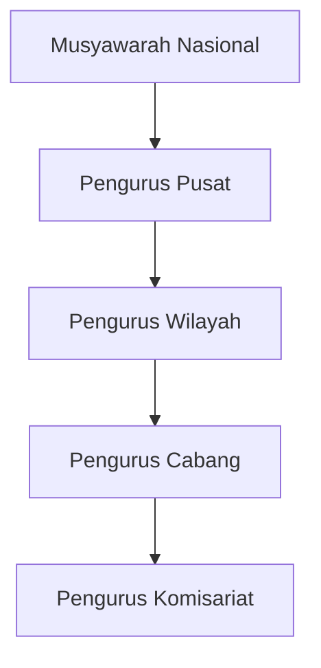

# Struktur Organisasi ISPI Nasional

## Hierarki Organisasi

## Pengurus Pusat (2024-2029)

### Ketua Umum
**[Nama Ketua Umum]**
- Memimpin organisasi secara keseluruhan
- Merumuskan kebijakan strategis
- Mewakili ISPI di forum nasional dan internasional

### Wakil Ketua Umum

**Wakil Ketua I: [Nama]**
- Membidangi Organisasi dan Keanggotaan

**Wakil Ketua II: [Nama]**  
- Membidangi Pengembangan SDM dan Sertifikasi

### Sekretaris Jenderal
**[Nama Sekjen]**
- Mengelola administrasi organisasi
- Koordinasi antar bidang
- Pelaksanaan program kerja

### Bendahara Umum
**[Nama Bendahara]**
- Mengelola keuangan organisasi
- Pelaporan keuangan
- Asset management

## Bidang-Bidang

### Bidang Organisasi dan Keanggotaan
**Ketua Bidang: [Nama]**

**Tugas:**
- Pengembangan organisasi
- Rekrutmen anggota baru
- Database keanggotaan
- Hubungan antar anggota

### Bidang Pendidikan dan Pelatihan
**Ketua Bidang: [Nama]**

**Tugas:**
- Program pelatihan teknis
- Webinar dan seminar
- Kerjasama dengan institusi pendidikan
- Kurikulum pelatihan

### Bidang Sertifikasi dan Kompetensi
**Ketua Bidang: [Nama]**

**Tugas:**
- Sertifikasi kompetensi
- Standar profesi
- Kerjasama dengan LSP
- Continuing Professional Development (CPD)

### Bidang Hukum dan Advokasi
**Ketua Bidang: [Nama]**

**Tugas:**
- Bantuan hukum anggota
- Advokasi kebijakan
- Regulasi konstruksi
- Penyelesaian sengketa

### Bidang Penelitian dan Pengembangan
**Ketua Bidang: [Nama]**

**Tugas:**
- Penelitian konstruksi
- Inovasi teknologi
- Publikasi ilmiah
- Standar teknis

### Bidang Hubungan Masyarakat dan Kerjasama
**Ketua Bidang: [Nama]**

**Tugas:**
- Media dan publikasi
- Website dan medsos
- Kerjasama eksternal
- Event dan acara

### Bidang Usaha dan Kesejahteraan
**Ketua Bidang: [Nama]**

**Tugas:**
- Unit usaha organisasi
- Koperasi anggota
- Program kesejahteraan
- Dana pensiun

## Badan Pengawas

**Ketua: [Nama]**

**Tugas:**
- Mengawasi jalannya organisasi
- Audit keuangan dan program
- Evaluasi kinerja pengurus
- Laporan kepada Munas

## Dewan Penasehat

Terdiri dari tokoh-tokoh senior yang memberikan arahan strategis:

- [Nama Penasehat 1]
- [Nama Penasehat 2]
- [Nama Penasehat 3]

## Pengurus Wilayah

ISPI memiliki Pengurus Wilayah di 34 provinsi seluruh Indonesia.

**Struktur:**
- Ketua
- Sekretaris
- Bendahara
- Bidang-bidang (sesuai kebutuhan)

**Wilayah Besar:**
- DKI Jakarta
- Jawa Barat
- Jawa Timur
- Jawa Tengah
- Sulawesi Selatan
- Sumatera Utara

## Pengurus Cabang

Tingkat kabupaten/kota dengan struktur:
- Ketua
- Sekretaris
- Bendahara

**Jumlah:** 100+ cabang di seluruh Indonesia

## Pengurus Komisariat

Di institusi pendidikan dan perusahaan:
- Ketua
- Sekretaris
- Anggota

## Mekanisme Kerja

### Rapat Koordinasi

- **Rapat Pleno Pengurus Pusat** - Bulanan
- **Rapat Koordinasi Wilayah** - Triwulan
- **Rapat Koordinasi Cabang** - Per semester

### Pelaporan

- Pengurus Cabang → Pengurus Wilayah
- Pengurus Wilayah → Pengurus Pusat
- Pengurus Pusat → Munas/Mukernas

## Musyawarah

### Musyawarah Nasional (Munas)
- Setiap 5 tahun
- Peserta: Utusan seluruh wilayah
- Agenda: Pemilihan pengurus, evaluasi program

### Musyawarah Kerja Nasional (Mukernas)
- Setiap 2,5 tahun (tengah periode)
- Agenda: Evaluasi dan penyusunan program

### Musyawarah Wilayah (Muswil)
- Setiap 5 tahun
- Tingkat provinsi
- Pemilihan pengurus wilayah

### Musyawarah Cabang (Muscab)
- Setiap 5 tahun
- Tingkat kabupaten/kota
- Pemilihan pengurus cabang

## Sekretariat

**Alamat:**  
Gedung [Nama Gedung]  
Jl. [Nama Jalan]  
Jakarta [Kode Pos]

**Kontak:**
- 📞 Telp: (021) XXXX-XXXX
- 📧 Email: sekretariat@ispinasional.or.id
- 🌐 Website: https://ispinasional.or.id

**Jam Operasional:**  
Senin - Jumat: 08:00 - 17:00 WIB

## Hubungi Pengurus

Untuk komunikasi dengan pengurus:
- 📧 ketua@ispinasional.or.id
- 📧 sekretaris@ispinasional.or.id
- 📧 bendahara@ispinasional.or.id

---

> **Catatan:** Informasi pengurus akan diupdate setelah Munas. Untuk informasi pengurus wilayah/cabang, silakan hubungi sekretariat.
